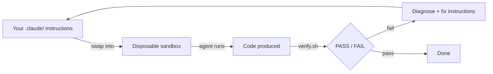

# agent-spec

Deterministic test harness for Claude Code agents and skills.

agent-spec takes any project, launches autonomous agents in disposable sandboxes, scores their output, and uses failures as signal to iteratively improve the project's `.claude/` instructions — until agents succeed without human intervention.



## Quick Start

```bash
cd agent-spec/agent-spec

# See what's available
python3 scripts/cli.py list

# Run an evaluation
python3 scripts/cli.py run csv-reporter

# Run 3 times to check consistency
python3 scripts/cli.py run csv-reporter --parallel --instances 3

# A/B test two instruction sets
python3 scripts/cli.py run csv-reporter --parallel --configs baseline,tuned

# View results
python3 scripts/cli.py report --all
```

## What It Does

1. **Copies** your project to a temporary sandbox
2. **Swaps** `.claude/` with a config variant you want to test
3. **Deletes** key files so the agent must produce them (cordyceps injection)
4. **Runs** `claude -p` with your prompt inside the sandbox
5. **Scores** the result with a deterministic `verify.sh` script
6. **Reports** PASS/FAIL with cost and token metrics

The agent never touches your real code. Only the disposable sandbox is modified.

## The Iterate Loop

The real power is automated iteration. The `/iterate` skill:

1. Launches N parallel agents against your target
2. Scores each run
3. Reads failures and classifies them
4. Patches your `.claude/` instructions to close the gaps
5. Repeats until all agents pass consistently

```bash
# Inside Claude Code
/iterate csv-reporter
```

## Documentation

- [Getting Started](agent-spec/docs/getting-started.md) — First run in 2 minutes
- [Architecture](agent-spec/docs/architecture.md) — How the system works, with diagrams
- [Writing Targets](agent-spec/docs/writing-targets.md) — Add your own project as a test target
- [CLI Reference](agent-spec/docs/cli-reference.md) — Every command and flag

## Key Concepts

| Concept           | Description                                                |
| ----------------- | ---------------------------------------------------------- |
| **Target**        | A project + task + scoring script                          |
| **Config**        | A `.claude/` directory variant to test                     |
| **Sandbox**       | Disposable copy of the project in `/tmp/`                  |
| **Cordyceps**     | Modifying the sandbox before the agent sees it             |
| **Verify script** | `verify.sh` that outputs `RESULT: PASS` or `RESULT: FAIL` |

## Project Structure

```text
agent-spec/
├── scripts/           # Core harness
│   ├── cli.py         # Unified CLI entry point
│   ├── invoke.py      # Single run: sandbox → agent → verify
│   ├── parallel.py    # Multi-run: A/B tests, benchmarks
│   ├── dashboard.py   # Live monitoring
│   └── report.py      # Comparison reports
├── targets/           # Test fixtures
│   ├── _shared/       # Configs shared across targets
│   └── csv-reporter/  # Example target
├── docs/              # Documentation
└── .claude/           # agent-spec's own instructions
```

## Requirements

- [Claude Code CLI](https://docs.anthropic.com/en/docs/claude-code) installed and authenticated
- Python 3.12+
