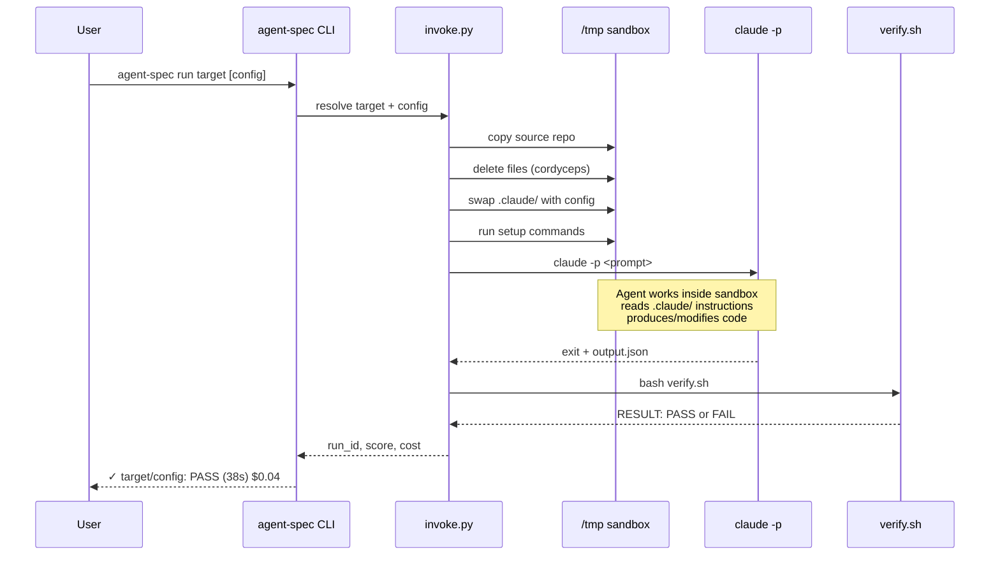
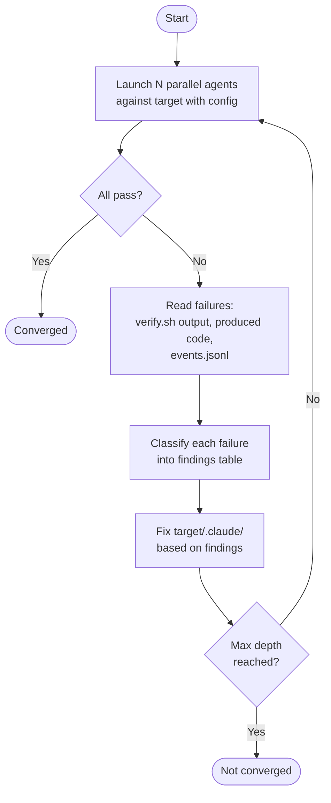
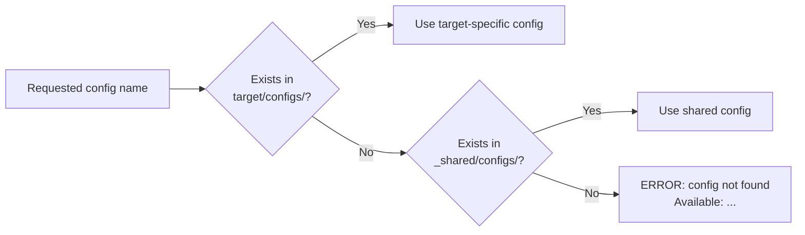
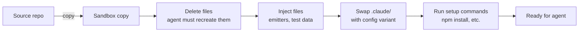

# Architecture

agent-spec is a test harness for `.claude/` directories. It launches Claude agents in disposable sandboxes, scores their output deterministically, and uses failures as signal to improve the instructions.

## System Overview

```mermaid
graph TB
    subgraph "Level 0: Orchestrator"
        CLI[agent-spec CLI]
        INVOKE[invoke.py]
        PARALLEL[parallel.py]
        ITERATE[/iterate skill]
    end

    subgraph "Level 1: Sandboxed Agents"
        S1[Sandbox 1<br>/tmp/claude/agent-spec-abc/]
        S2[Sandbox 2<br>/tmp/claude/agent-spec-def/]
        S3[Sandbox N<br>/tmp/claude/agent-spec-ghi/]
    end

    subgraph "Level 2: The Product"
        CLAUDE[target/.claude/<br>CLAUDE.md, rules/, skills/]
    end

    CLI --> INVOKE
    CLI --> PARALLEL
    PARALLEL --> INVOKE
    ITERATE --> PARALLEL
    INVOKE -->|copy source + swap .claude/| S1
    INVOKE -->|copy source + swap .claude/| S2
    INVOKE -->|copy source + swap .claude/| S3
    CLAUDE -.->|read by agents inside| S1
    CLAUDE -.->|read by agents inside| S2
    CLAUDE -.->|read by agents inside| S3
    S1 -->|PASS/FAIL| ITERATE
    S2 -->|PASS/FAIL| ITERATE
    S3 -->|PASS/FAIL| ITERATE
    ITERATE -->|diagnose + fix| CLAUDE
```

## Run Lifecycle

A single evaluation follows this sequence:



## Iteration Loop

The `/iterate` skill automates the feedback loop:



## Config Resolution

Configs are `.claude/` directories that get swapped into the sandbox. They resolve with target-specific taking priority:



## Cordyceps Injection

The sandbox is a disposable copy. Before the agent sees it, the harness can modify anything:



The original repo is never modified. The name comes from the [cordyceps fungus](https://en.wikipedia.org/wiki/Cordyceps) — the harness takes over its host.

## Directory Structure

```
agent-spec/
├── scripts/           # Core harness scripts
│   ├── cli.py         # Unified entry point
│   ├── invoke.py      # Single run: sandbox + agent + verify
│   ├── parallel.py    # Multi-run: A/B tests, benchmarks
│   ├── dashboard.py   # Live monitoring
│   ├── report.py      # Comparison reports
│   └── lib.py         # Shared utilities
├── targets/           # Test fixtures
│   ├── _shared/       # Configs shared across targets
│   │   └── configs/
│   │       ├── baseline/
│   │       ├── structured/
│   │       └── ...
│   ├── csv-reporter/
│   │   ├── target.yaml
│   │   ├── prompt.md
│   │   ├── verify.sh
│   │   └── configs/
│   │       └── tuned/
│   └── ...
├── docs/              # Documentation
│   ├── architecture.md
│   ├── getting-started.md
│   ├── cli-reference.md
│   └── writing-targets.md
├── results/           # Archived run results (git-ignored)
└── .claude/           # agent-spec's own instructions
    ├── CLAUDE.md
    ├── rules/
    ├── skills/
    └── reference/
```
