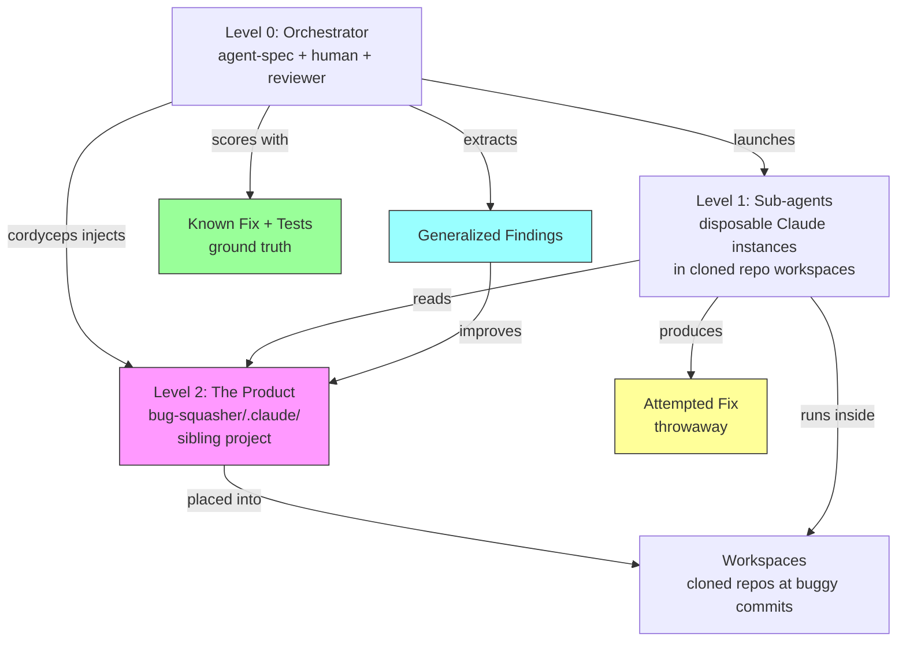
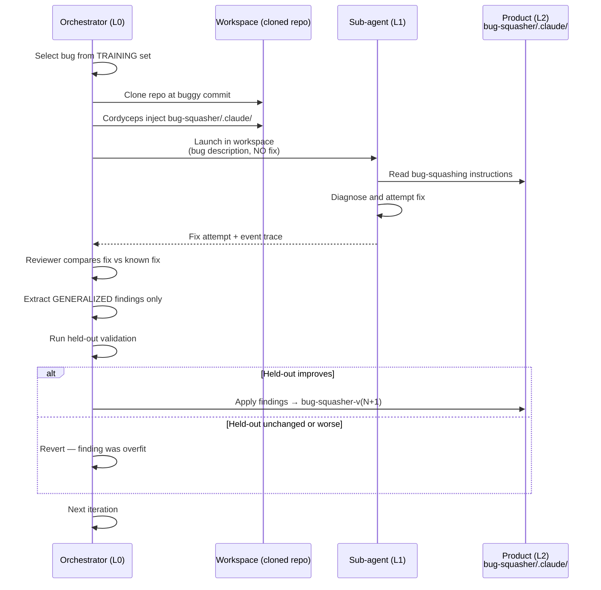
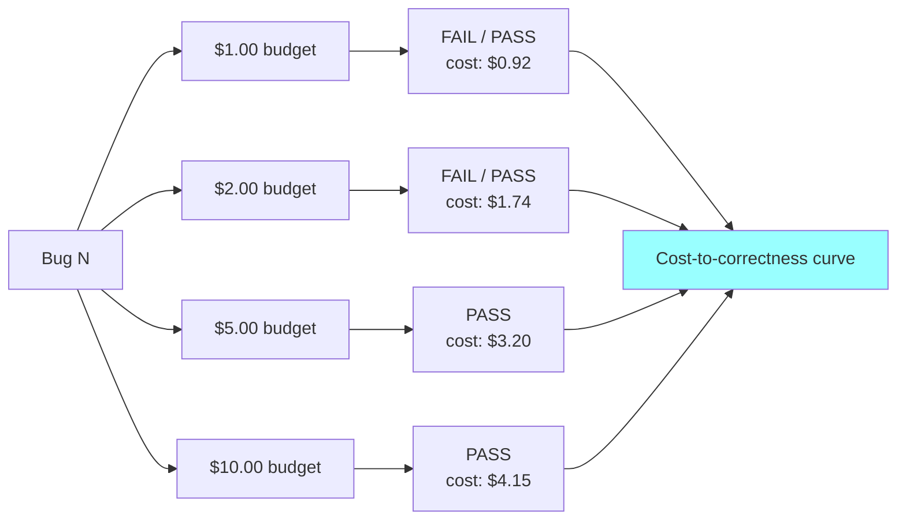

# Bug-Squashing Recursive Training Loop

## Overview

A self-improving system that trains a bug-squashing `.claude/` directory using known deterministic results. GitHub bugs with committed fixes serve as ground truth. The loop tunes the product's instructions — not any agent's code. Every improvement must be generalized.

## Level Mapping

This follows agent-spec's recursive architecture exactly (see `.claude/reference/recursive-training.md`):

- **Level 0 (Orchestrator):** agent-spec + human. Launches agents, runs the reviewer, scores results, diagnoses instruction gaps, applies fixes.
- **Level 1 (Sub-agents):** Disposable Claude instances in cloned repo workspaces. They follow the bug-squasher instructions, attempt fixes. Their fixes are throwaway — their *behavior* reveals instruction gaps.
- **Level 2 (The Product):** The bug-squasher `.claude/` directory. A standalone set of instructions that, when placed into any repo, makes an agent capable of diagnosing and fixing bugs. Must never reference agent-spec.

The cloned repos (rich, marshmallow, etc.) are **workspaces** — the environment Level 1 runs in. They are not a separate level. Cordyceps injects the Level 2 `.claude/` into each workspace before the agent starts.

**Where the product lives:** `bug-squasher/.claude/` — a sibling project alongside `agent-spec/`, `csv-reporter/`, and `hono-websocket-counter/`. The eval symlinks to it: `evals/bug-squashing/configs/bug-squasher → ../../../../bug-squasher/.claude`. Cordyceps injects it into cloned repo workspaces.

**At convergence:** The `bug-squasher/` directory is self-sufficient. Its `.claude/` can be copied into any repo to make an agent capable of bug-fixing. agent-spec is no longer needed.

## Architecture



**What is throwaway:** Level 1 agents, their attempted fixes, workspaces, reviewer output.

**What is permanent:** Level 2 instructions (`bug-squasher/.claude/`), generalized findings applied to the product.

## The Iteration Loop



## The Generalization Gate

The reviewer has the answer key, which creates an overfitting risk. Every finding must pass the generalization filter before it can modify the product.

```mermaid
flowchart LR
    F[Finding from Reviewer]
    T1{Names a library,<br/>error type, or domain?}
    T2{Would help on a<br/>completely different project?}
    T3{Principle or recipe?}
    V{Held-out validation:<br/>pass rate improved?}

    F --> T1
    T1 -->|Yes| REJECT[Reject: overfit]
    T1 -->|No| T2
    T2 -->|No| REJECT
    T2 -->|Yes| T3
    T3 -->|Recipe| REJECT
    T3 -->|Principle| APPLY[Apply to product]
    APPLY --> V
    V -->|No| REVERT[Revert change]
    V -->|Yes| COMMIT[Commit as v(N+1)]

    style REJECT fill:#f99
    style COMMIT fill:#9f9
    style REVERT fill:#ff9
```

## Budget Ladder Integration

Same bug, same instructions, different budgets. Measures cost-to-correctness — the primary metric.



As the product improves, the curve shifts left — bugs get fixed at lower budgets.

## Train/Held-Out Split

```mermaid
graph TD
    BENCH[Bug Benchmark<br/>N GitHub bugs with known fixes]
    BENCH --> TRAIN[Training Set ~60%<br/>Reviewer sees bugs + fixes]
    BENCH --> HELD[Held-Out Set ~40%<br/>Reviewer NEVER sees these]

    TRAIN --> LOOP[Iteration Loop<br/>Extract findings]
    LOOP --> APPLY[Apply to product]
    APPLY --> VAL[Validate on held-out]
    VAL -->|Improved| KEEP[Keep as v(N+1)]
    VAL -->|No change| DROP[Revert: overfit]

    style HELD fill:#f9f,stroke:#333
    style TRAIN fill:#9f9,stroke:#333
```

## Convergence Criteria

The loop converges when:

1. **Pass rate on held-out set** stops improving across iterations
2. **Cost-to-correctness** on held-out set stabilizes
3. **Instruction changes** become smaller (diminishing returns)

At convergence, the bug-squasher `.claude/` is self-sufficient. agent-spec is no longer needed — the product can be placed into any repo.

Measured per iteration:

| Metric | How |
|--------|-----|
| Training pass rate | % of training bugs fixed |
| Held-out pass rate | % of held-out bugs fixed (the real score) |
| Avg cost to fix | Mean token cost across passing runs |
| Instruction delta | Lines changed in bug-squasher/.claude/ |

## What Each Agent Sees

| | Sub-agent (L1) | Reviewer (L0 tool) |
|---|---|---|
| Bug description | Yes | Yes |
| Repo at buggy commit | Yes | Yes |
| Bug-squasher `.claude/` | Yes (follows it) | Yes (evaluates it) |
| GitHub issue/discussion | No | Yes |
| Known fix commit | No | Yes |
| Agent's attempted fix | (produces it) | Yes |

## Workspace Setup

For each bug in the benchmark:

1. Clone the repo at the **parent of the fix commit** (the buggy state)
2. Cordyceps injects the bug-squasher `.claude/` (the current version)
3. Agent gets bug description from the GitHub issue (sanitized of fix hints)
4. `verify.sh` runs the repo's own test suite
5. The known fix commit is stored separately for the reviewer, never in the workspace

This matches the existing eval pattern exactly — `run_eval.py` handles workspace creation, config injection, and verification.

## Guard Verification

| Guard | Check |
|-------|-------|
| Guard 1 (filesystem scope) | Sub-agents write only to their workspace |
| Guard 2 (identity confusion) | Every fix classified as L0 or L2 before applying |
| Guard 3 (branch isolation) | Product versions are configs in the eval, not main branch changes |
| Guard 4 (recursion depth) | `grep -r "agent-spec" bug-squasher/.claude/` returns nothing |

## Next Steps

1. Source 8-12 GitHub bugs (post-May 2025, with fix commits and tests) — done in benchmark.md
2. Split into training (5) and held-out (3)
3. Write initial bug-squasher product: `bug-squasher/.claude/CLAUDE.md` (done)
4. Build first challenge (one bug, manually) to validate the workspace/verify pattern
5. Build reviewer skill in agent-spec (Level 0 tool)
6. Run first iteration, measure baseline
