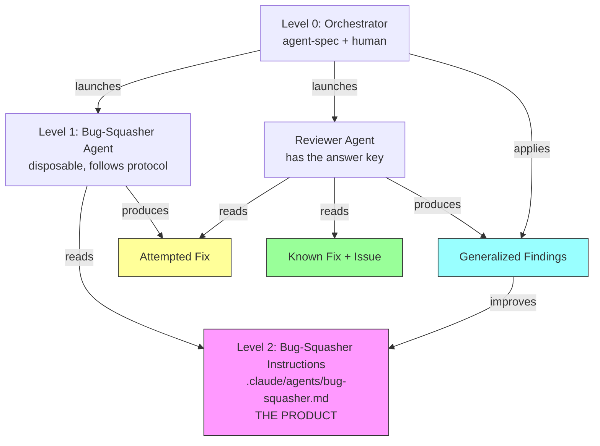
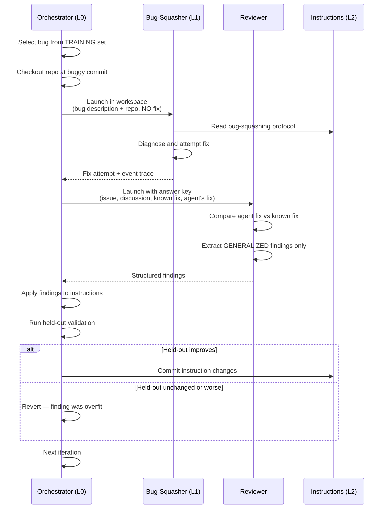
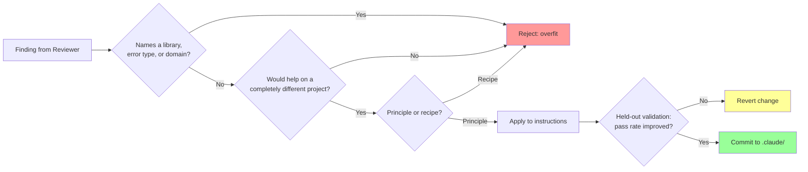
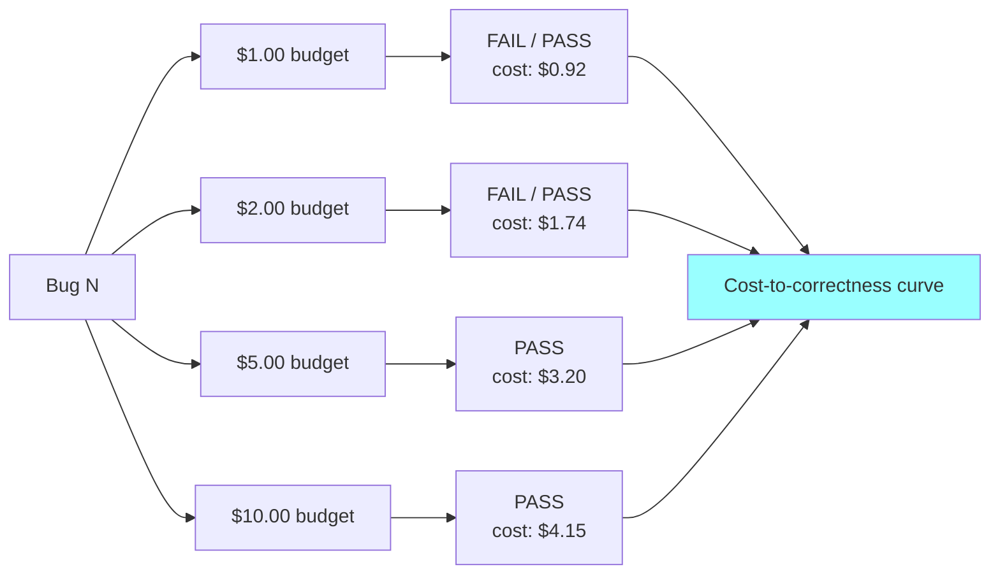
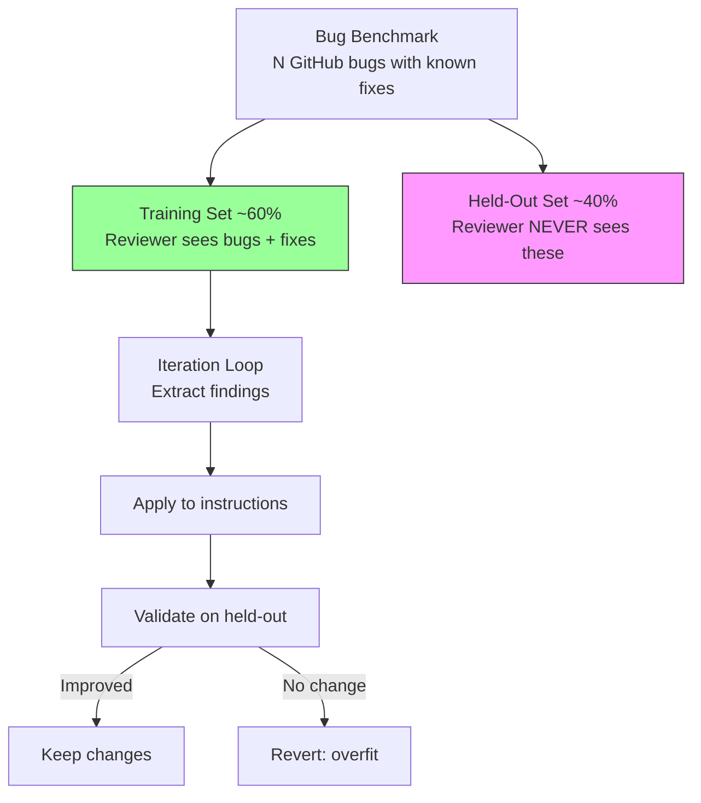

# Bug-Squashing Recursive Training Loop

## Overview

A self-improving system that trains a bug-squashing agent using known deterministic results. GitHub bugs with committed fixes serve as ground truth. The loop tunes the agent's instructions — not its code. Every improvement must be generalized.

## Architecture

Three levels, matching agent-spec's recursive model:

**What is throwaway:** Level 1 agents, their attempted fixes, reviewer instances, workspaces.

**What is permanent:** Level 2 instructions (`.claude/agents/bug-squasher.md`), generalized findings committed to `.claude/`.

## The Iteration Loop

## The Generalization Gate

The reviewer has the answer key, which creates an overfitting risk. Every finding must pass the generalization filter before it can modify instructions.

## Budget Ladder Integration

Same bug, same instructions, different budgets. Measures cost-to-correctness — the primary metric.

As instructions improve, the curve shifts left — bugs get fixed at lower budgets.

## Train/Held-Out Split

## Convergence Criteria

The loop converges when:

1. **Pass rate on held-out set** stops improving across iterations
2. **Cost-to-correctness** on held-out set stabilizes
3. **Instruction changes** become smaller (diminishing returns)

Measured per iteration:

| Metric | How |
|--------|-----|
| Training pass rate | % of training bugs fixed |
| Held-out pass rate | % of held-out bugs fixed (the real score) |
| Avg cost to fix | Mean token cost across passing runs |
| Instruction delta | Lines changed in bug-squasher.md |

## What Each Agent Sees

| | Bug-Squasher (L1) | Reviewer |
|---|---|---|
| Bug description | Yes | Yes |
| Repo at buggy commit | Yes | Yes |
| GitHub issue/discussion | No | Yes |
| Known fix commit | No | Yes |
| Agent's attempted fix | (produces it) | Yes |
| Bug-squasher instructions | Yes (follows them) | Yes (evaluates them) |

## Workspace Setup

For each bug in the benchmark:

1. Clone the repo at the **parent of the fix commit** (the buggy state)
2. Place bug description in `prompt.md` (from the GitHub issue, sanitized of fix hints)
3. `verify.sh` runs the repo's own test suite
4. The known fix commit is stored separately for the reviewer, never in the workspace

## Next Steps

1. Source 8-12 GitHub bugs (post-May 2025, with fix commits and tests)
2. Split into training (5-7) and held-out (3-5)
3. Build `.claude/agents/bug-squasher.md` — initial protocol
4. Build `.claude/agents/bug-reviewer.md` — structured reviewer with generalization enforcement
5. Build `.claude/skills/bug-squashing-loop/SKILL.md` — orchestrator
6. Run first iteration, measure baseline
