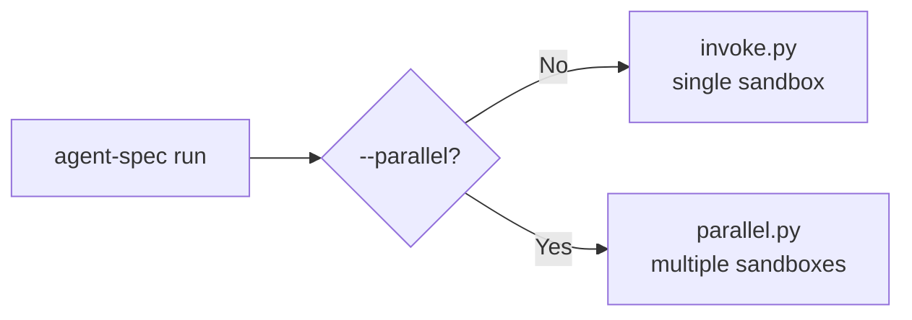

# CLI Reference

All commands are run via `python3 scripts/cli.py` (alias: `agent-spec`).

## Commands

### `agent-spec run`

Run an evaluation against a target.

```
agent-spec run <target> [config] [options]
```

| Option | Default | Description |
|--------|---------|-------------|
| `config` | `baseline` | Config name to use |
| `--model` | from target.yaml | Model override |
| `--budget` | from target.yaml | Budget in USD |
| `--keep` | false | Preserve sandbox after run |
| `--port` | auto-allocated | Port override (3100-3110) |
| `--inject` | | Directory to inject into sandbox |
| `--verbose` | false | Show sandbox lifecycle details |
| `--parallel` | false | Run in parallel mode |
| `--instances N` | 1 | Number of parallel runs |
| `--configs a,b` | | Comma-separated configs for A/B test |
| `--models a,b` | | Comma-separated models for benchmark |
| `--stimuli-dir` | | Per-instance files to inject (round-robin) |



**Examples:**

```bash
# Basic run
agent-spec run csv-reporter

# Specific config
agent-spec run csv-reporter tuned

# A/B test two configs
agent-spec run csv-reporter --parallel --configs baseline,tuned

# Benchmark two models
agent-spec run csv-reporter --parallel --models claude-sonnet-4-6,claude-haiku-4-5-20251001

# Run 5 times for consistency
agent-spec run csv-reporter --parallel --instances 5

# With verbose sandbox output
agent-spec run csv-reporter --verbose
```

---

### `agent-spec status`

Show run dashboard. Defaults to the latest run.

```
agent-spec status [run_id] [options]
```

| Option | Description |
|--------|-------------|
| `--latest` | Show most recent run (default when no run_id) |
| `--summary` | One-shot summary, no live tail |
| `--stream` | Compact one-line-per-event, no color (grep-friendly) |
| `--diff <id1> <id2>` | Config diff between two runs |
| `--parallel <id>` | Multi-instance status table |

**Examples:**

```bash
# Live tail of latest run
agent-spec status

# Summary of a specific run
agent-spec status a1b2c3d4 --summary

# Compare configs between two runs
agent-spec status --diff a1b2c3d4 e5f6g7h8

# Parallel run status table
agent-spec status --parallel p-a1b2c3d4
```

---

### `agent-spec report`

Generate comparison reports across runs.

```
agent-spec report [run_ids...] [options]
```

| Option | Description |
|--------|-------------|
| `--all` | Include all runs |
| `--latest` | Most recent run only |
| `--group-by {config,model,target}` | Group and compare |
| `--compare <id1> <id2>` | Side-by-side two-run diff |
| `--session <id>` | Iterate session report by depth |

**Examples:**

```bash
# All runs, grouped by config
agent-spec report --all --group-by config

# Compare two specific runs
agent-spec report --compare a1b2c3d4 e5f6g7h8

# Iterate session report
agent-spec report --session s-a1b2c3d4
```

---

### `agent-spec tokens`

Show token metrics and costs.

```
agent-spec tokens [run_id] [options]
```

| Option | Description |
|--------|-------------|
| `--session <id>` | Cost rollup across an iterate session |

---

### `agent-spec list`

Discover all targets and their available configs. Shows the last PASS/FAIL result for each target.

```
agent-spec list
```

Output:

```
csv-reporter  [PASS]
  baseline (shared)
  tuned
  structured (shared)
hono-websocket-counter  [PASS]
  baseline (shared)
  control
  tuned
```

---

### `agent-spec clean`

Stop all agent-spec processes, clear ports, remove sandboxes.

```
agent-spec clean [--force]
```

| Option | Description |
|--------|-------------|
| `--force` | Also delete /tmp run logs |

---

## Claude Code Skills

These are available inside Claude Code sessions (not from the shell):

| Skill | Description |
|-------|-------------|
| `/run-eval <target> [config]` | Run one evaluation |
| `/iterate <target>` | Parallel agents + diagnose + fix + recurse |
| `/report` | View results |
| `/stop` | Halt everything |
| `/new-target` | Scaffold a new target |

## Live Output

During a run, you see a live status line:

```
── csv-reporter/tuned (claude-sonnet-4-6) ──
  Run:    a1b2c3d4
  Budget: $2.00

  ⠋ csv-reporter/tuned  42s  $0.03 / $2.00
```

If cost exceeds 2x the historical baseline, a warning appears:

```
  ⠋ csv-reporter/tuned  120s  $0.45 / $2.00  ⚠ 3.0x baseline
```

On completion:

```
  ✓ csv-reporter/tuned: PASS  (38s)  $0.04
```

## Environment Variables

| Variable | Default | Description |
|----------|---------|-------------|
| `TIMEOUT` | 600 | Agent timeout in seconds |
| `AGENT_SPEC_DEBUG` | 1 | Set to 0 to disable debug logging |
| `AGENT_SPEC_RUN_ID` | auto | Override run ID (set by harness) |
| `PORT` | auto | Port for target server (set by harness) |

## Exit Codes

- `agent-spec run` — 0 on success, 1 on failure
- `agent-spec run --parallel` — number of failed instances
- `agent-spec clean` — always 0
