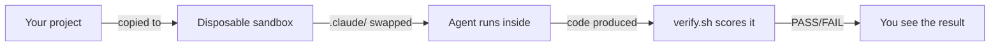

# Getting Started

agent-spec tests whether your `.claude/` instructions can guide an autonomous agent to complete a task correctly — with no human in the loop.

## Prerequisites

- [Claude Code CLI](https://docs.anthropic.com/en/docs/claude-code) installed and authenticated
- Python 3.12+
- A project with a `.claude/` directory you want to test

## Quick Start

```bash
# Clone the repo
git clone https://github.com/anthropics/agent-spec.git
cd agent-spec/agent-spec

# List available targets and configs
python3 scripts/cli.py list

# Run an evaluation
python3 scripts/cli.py run csv-reporter

# See the result
python3 scripts/cli.py status
```

## What Just Happened



1. agent-spec copied the target repo to a temporary sandbox
2. Swapped in the `baseline` config as the sandbox's `.claude/` directory
3. Ran `claude -p` with the target's prompt inside the sandbox
4. Ran `verify.sh` to score the result as PASS or FAIL
5. Cleaned up the sandbox

## Core Workflow

### 1. Run a single evaluation

```bash
python3 scripts/cli.py run <target> [config]
```

You'll see a live status line showing elapsed time and cost:

```
── csv-reporter/baseline (claude-sonnet-4-6) ──
  Run:    a1b2c3d4
  Budget: $2.00

  ⠋ csv-reporter/baseline  42s  $0.03 / $2.00
```

Then a final result:

```
  ✓ csv-reporter/baseline: PASS  (38s)  $0.04
```

### 2. Compare configs

Test two different `.claude/` directories against the same task:

```bash
python3 scripts/cli.py run csv-reporter --parallel --configs baseline,tuned
python3 scripts/cli.py report --all --group-by config
```

### 3. Iterate until green

The `/iterate` skill automates the full loop — run agents, diagnose failures, fix instructions, repeat:

```bash
# Inside Claude Code
/iterate csv-reporter
```

### 4. Onboard your own project

```bash
# Inside Claude Code
/new-target
```

This scaffolds a new target directory. You provide:
- A source repo path
- A prompt describing the task
- A `verify.sh` that outputs `RESULT: PASS` or `RESULT: FAIL`

See [Writing Targets](writing-targets.md) for details.

## CLI Reference

| Command | What it does |
|---------|-------------|
| `agent-spec list` | Show all targets and their configs |
| `agent-spec run <target> [config]` | Run one evaluation |
| `agent-spec run <target> --parallel --instances 3` | Run N times for consistency |
| `agent-spec run <target> --parallel --configs a,b` | A/B test two configs |
| `agent-spec status` | Show latest run dashboard |
| `agent-spec status <run_id> --summary` | One-shot summary |
| `agent-spec report --all` | Report across all runs |
| `agent-spec report --all --group-by config` | Compare configs |
| `agent-spec tokens <run_id>` | Token usage for a run |
| `agent-spec clean` | Stop everything, remove sandboxes |

Full reference: [CLI Reference](cli-reference.md)

## Key Concepts

- **Target** — A project + task + scoring script to test against
- **Config** — A `.claude/` directory variant to swap into the sandbox
- **Sandbox** — A disposable copy of the target repo in `/tmp/`
- **Cordyceps** — Modifying the sandbox before the agent sees it (deleting files, injecting data)
- **Verify script** — A bash script that outputs `RESULT: PASS` or `RESULT: FAIL`

## Next Steps

- [Architecture](architecture.md) — How the system works end-to-end
- [Writing Targets](writing-targets.md) — Add your own project as a test target
- [CLI Reference](cli-reference.md) — Every command and flag
