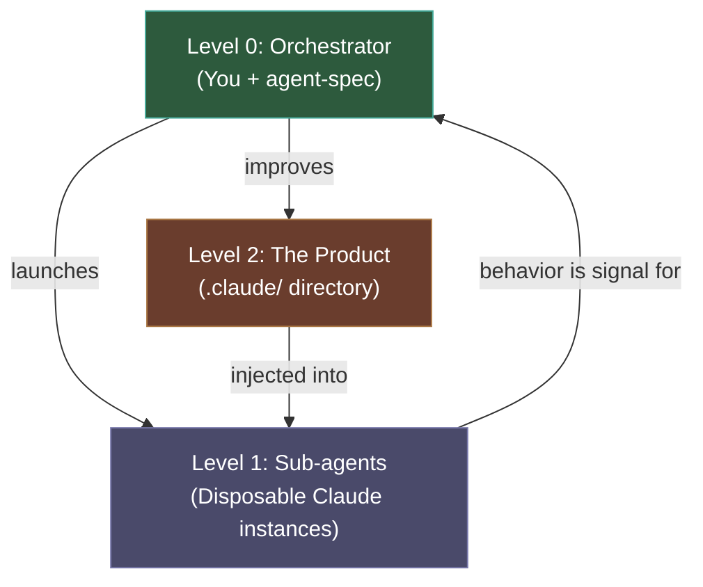
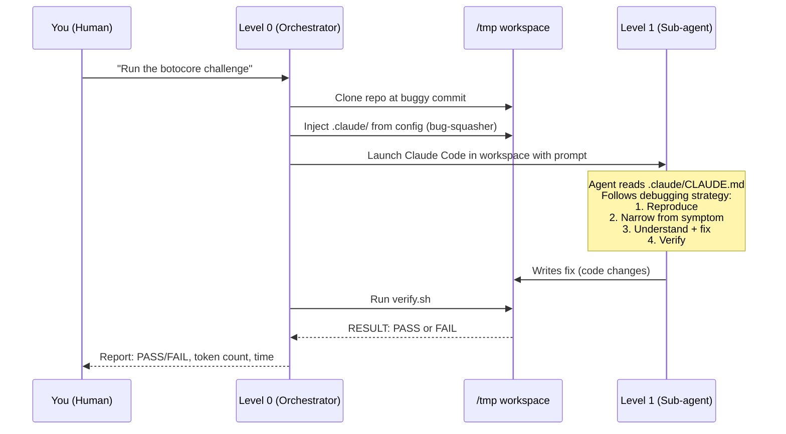
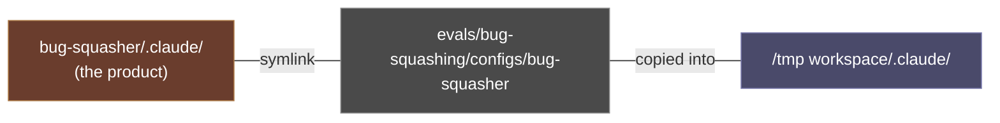
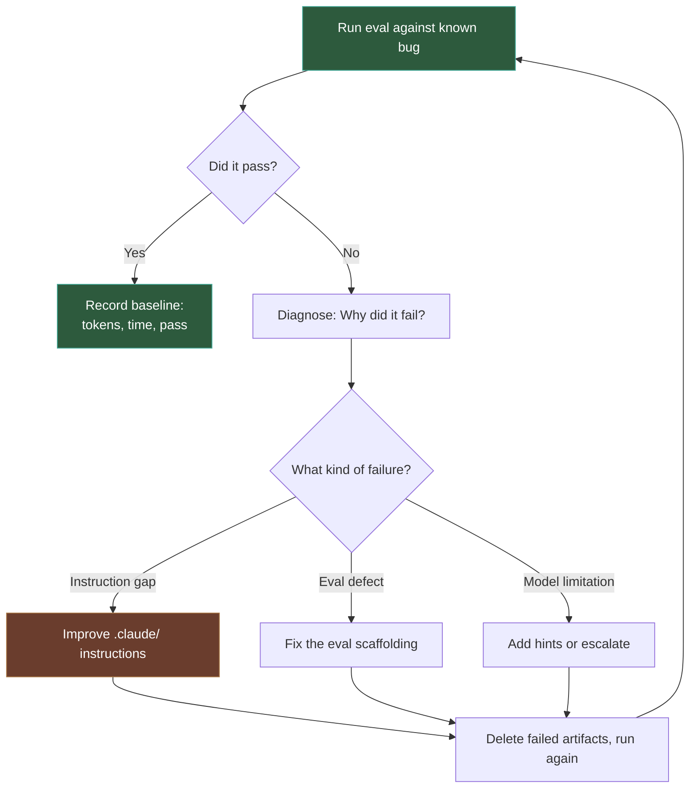
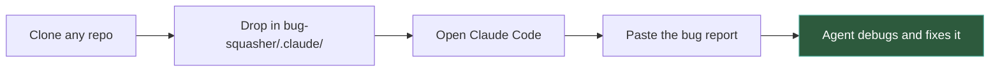
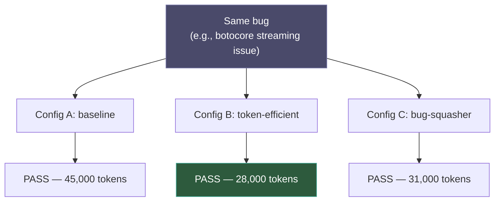

# How agent-spec Works

## The Big Idea

agent-spec builds and tests `.claude/` instruction sets — the files that tell a Claude Code agent how to approach a task. The end product is a portable `.claude/` directory that anyone can drop into a repo and use.

The bug-squasher is the first example: a `.claude/` directory that teaches Claude Code how to debug and fix bugs in any open-source project.

## Three Levels

agent-spec operates as a recursive system with three nested levels.

| Level | What it is | What it does |
|-------|-----------|--------------|
| **Level 0** | You + agent-spec | Launches agents, scores results, diagnoses failures, improves instructions |
| **Level 1** | Disposable Claude instances in `/tmp` workspaces | Does the actual work (e.g., fixes a bug). Code is throwaway — behavior is the signal |
| **Level 2** | The `.claude/` directory (e.g., bug-squasher) | The product. Must be self-sufficient — the agent reading it never knows agent-spec exists |

## What Happens During an Eval Run

## Where the Config Comes From

The bug-squasher `.claude/` directory lives as a standalone product at `bug-squasher/.claude/`. The eval symlinks to it:

This separation matters: the config is **not** an eval artifact. It's the real product. Evals just test it.

## The Self-Improvement Loop

When an eval fails, the failure is signal about the instructions, not about the eval.

The key metric is **tokens-to-correctness** — not just pass/fail, but how efficiently the agent got there.

## Using It Yourself

The whole point of Level 2 being self-sufficient is that you can use it directly, without agent-spec:

That's it. The agent reads the `.claude/CLAUDE.md`, follows the debugging strategy (reproduce, narrow, understand, fix, verify), and produces a fix. It doesn't know or care that agent-spec trained those instructions.

## Configs as Experiments

Different configs represent different instruction strategies. You can A/B test them:

Same bug, different instructions, compare results. This is how you know which instruction strategies actually work — not by reading them and guessing, but by measuring.

## Summary

| Concept | In plain terms |
|---------|---------------|
| **agent-spec** | A training harness for `.claude/` instruction sets |
| **Level 0** | The coach watching game film |
| **Level 1** | The players on the field |
| **Level 2** | The playbook the players follow |
| **Eval** | A known challenge with a deterministic pass/fail check |
| **Config** | A `.claude/` directory variant to test |
| **Tokens-to-correctness** | The headline metric — how much work to get the right answer |
| **Bug-squasher** | The first product — a `.claude/` that teaches debugging |
