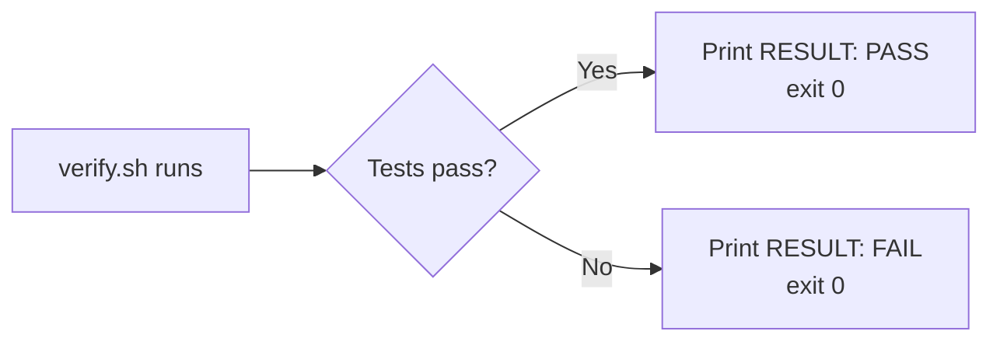
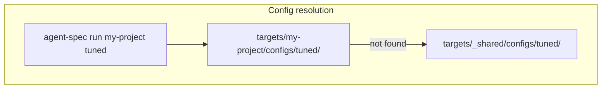
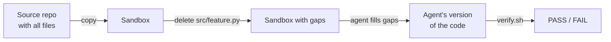

# Writing Targets

A target is a test case for agent-spec. It defines: a source project, a task for the agent, and a way to score the result.

## Target Structure

```
targets/my-project/
├── target.yaml      # Source repo, settings, cordyceps rules
├── prompt.md        # The task given to the agent
├── verify.sh        # Scoring script: outputs RESULT: PASS or RESULT: FAIL
└── configs/         # Target-specific .claude/ variants (optional)
    └── tuned/
        └── CLAUDE.md
```

## target.yaml

```yaml
source: ../../../my-project        # Path to the source repo (relative to target dir)
verify: verify.sh                  # Scoring script name

delete_before_run:                 # Files to delete from sandbox (agent must recreate)
  - src/feature.py
  - tests/test_feature.py

setup:                             # Commands to run before agent starts
  - npm install
  - pip install -r requirements.txt

agent:
  model: claude-sonnet-4-6         # Default model (overridable with --model)
  budget: '2.00'                   # Default budget in USD (overridable with --budget)
```

## prompt.md

The task description. This is passed directly to `claude -p`. Use `__PORT__` as a placeholder for the allocated port:

```markdown
Build a REST API server that listens on port __PORT__ with the following endpoints:
- GET /health returns {"status": "ok"}
- POST /data accepts JSON and stores it in memory
- GET /data returns all stored items

Run the tests to verify your implementation.
```

## verify.sh

The scoring script. It must:

1. Exit 0 always (even on test failure — exit code is not the scoring mechanism)
2. Print `RESULT: PASS` or `RESULT: FAIL` as the final verdict
3. Run inside the sandbox directory



### Example: Python project

```bash
#!/bin/bash
cd "$(dirname "$0")"

# Run tests
output=$(python3 -m pytest tests/ -v 2>&1)
echo "$output"

# Score
if echo "$output" | grep -q "passed"; then
    echo "RESULT: PASS"
else
    echo "RESULT: FAIL"
fi
```

### Example: Node.js with server

```bash
#!/bin/bash
cd "$(dirname "$0")"

# Start the server
PORT=${PORT:-3100}
node server.js &
SERVER_PID=$!
sleep 2

# Run tests
output=$(node test.js 2>&1)
echo "$output"

# Stop server
kill $SERVER_PID 2>/dev/null

# Score
if echo "$output" | grep -q "5/5 tests passed"; then
    echo "RESULT: PASS"
else
    echo "RESULT: FAIL"
fi
```

### Hidden Output Contracts

When `verify.sh` greps for specific strings (like `"5/5 tests passed"`), this creates a **hidden contract** between the test output format and the scoring script. If `delete_before_run` removes the test file and the agent recreates it with different wording, verify.sh breaks even though all tests actually pass.

Fix this by documenting the expected output format in your config's CLAUDE.md:

```markdown
If test.py does not exist, create it. The test output must include
the exact string "5/5 tests passed" on success.
```

## Configs

Configs are `.claude/` directories that get swapped into the sandbox. Each config is a test variant — different instructions for the same task.



**Target-specific configs** live in `targets/<name>/configs/<config>/`. These override shared configs of the same name.

**Shared configs** live in `targets/_shared/configs/`. These apply to any target.

A config directory mirrors `.claude/` structure:

```
configs/tuned/
├── CLAUDE.md         # Main instructions
├── rules/            # Always-loaded rules
│   └── testing.md
└── skills/           # On-demand skills
    └── build/
        └── SKILL.md
```

## Cordyceps: Shaping the Sandbox

The `delete_before_run` field removes files from the sandbox before the agent starts. This forces the agent to produce them from scratch, which is the core testing mechanism.



You can also inject files by adding an `inject/` directory to your target or using the `--inject` flag. Injected files are copied into the sandbox root before the agent starts.

## Testing Your Target

```bash
# Run once with default config
python3 scripts/cli.py run my-project

# Run with verbose output to see sandbox details
python3 scripts/cli.py run my-project --verbose

# Run 3 times to check consistency
python3 scripts/cli.py run my-project --parallel --instances 3

# Try different configs
python3 scripts/cli.py run my-project --parallel --configs baseline,tuned
```

## Scaffolding

Use the `/new-target` skill inside Claude Code to generate the target structure interactively:

```
/new-target
```
